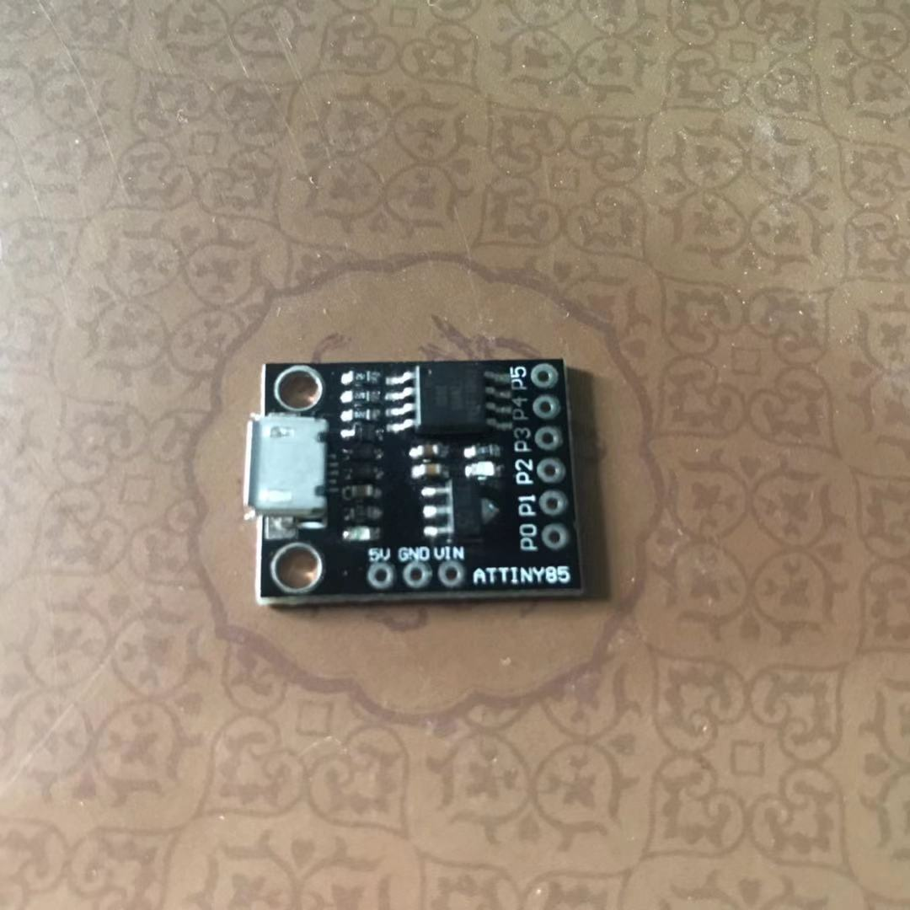
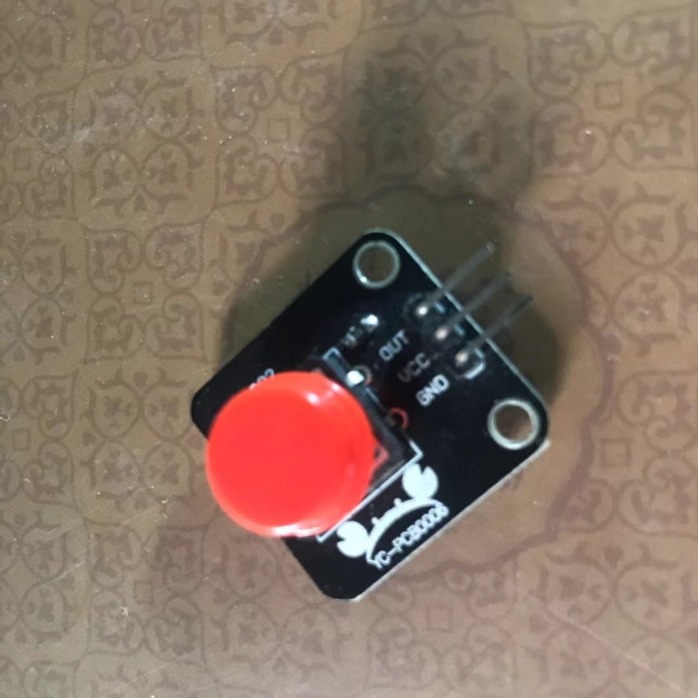

## 一键按钮

### 硬件部分

attiny85



按钮



把attiny85和按钮焊接到一起


### 工具部分

以管理员模式运行arduino。否则attiny的驱动会有问题。
首先，在arduino的首选项里输入如下内容：

```
http://digistump.com/package_digistump_index.json
```


以增加对attiny85的支持。然后在开发板管理器中，搜索digistump，找到名为 Digistump AVR Boards的选项，点击右下角的安装。


之后，就可以选择这块板子了。


这个时候，插上attiny85，然后右键我的电脑，打开设备管理器。


如果你出现一个未知设备，则需要安装一个驱动。下载地址：github.com/micronucleu…
双击未知设备，进入详细页面。


然后安装驱动。注意红框处，保持一致，以免把正常的驱动给替换了。

然后安装libusb-win32，下拉列表把winUSB改成libusb-win32。之后点击Replace Driver。
安装完毕后，重新插拔attiny85开发板。


在设备管理器中，可以发现，这个未知设备跑到libusb-win32 devices下面了。


### 软件部分 

现在输入代码测试一下

```
#include "DigiKeyboard.h"
int buttonState = 0;  
void setup() {
  pinMode(1, INPUT_PULLUP);
  pinMode(2, OUTPUT);
  //pinMode(3, OUTPUT);
  digitalWrite(2, HIGH); 
}
void loop() {
  buttonState = digitalRead(1);
  if (buttonState == HIGH) {hELLO dIGISPARK!
    DigiKeyboard.sendKeyStroke(0);
    DigiKeyboard.println("123456");
    DigiKeyboard.sendKeyStroke(KEY_ENTER);
  }
}
```

然后点击上传，出现Plug in device now...的时候，重新插拔一下attiny85即可。


这个时候，就可以用来开机了。
